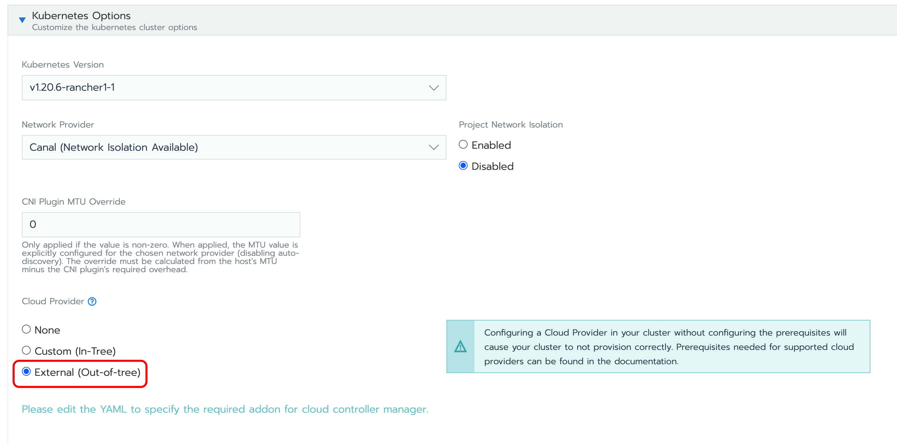

Harvester Cloud Provider
==========================
[](https://drone-publish.rancher.io/harvester/cloud-provider-harvester)
[](https://goreportcard.com/report/github.com/harvester/cloud-provider-harvester)
[](https://github.com/harvester/cloud-provider-harvester/releases)

Harvester Cloud Provider implements the Kubernetes Cloud Controller Manager and makes Harvester a Kubernetes cloud provider.

## Manifests and Deploying
Before deploying the Harvester cloud provider, your Kubernetes should be configured to allow external cloud providers.<br>
The ./manifests folder contains useful YAML manifests to use for deploying and developing the Harvester Cloud provider. The simply YAML creates a Deployment using the rancher/harvester-cloud-provider container.<br>
It's recommended to deploy the Harvester cloud provider at the same time when spin up the Kubernetes cluster using the Harvester node driver.<br>

### Deploy in the RKE
- Select the external cloud provider option.

  

- Generate addon configuration and add it in the rke yaml.
  ```
  # depend on kubectl to operate the Harvester
  ./deploy/generate_kubeconfig.sh <serviceaccount name> <namespace>
  ```
### Deploy in the RKE2
Select the `harvester` cloud provider, and the node driver will help deploy both the CSI driver and CCM automatically.


### Helm chart
To find the helm chart in the [harvester helm chart repo](https://charts.harvesterhci.io).

## How to Contribute

General guide is on [Harvester Developer Guide](https://github.com/harvester/harvester/blob/master/DEVELOPER_GUIDE.md).

### Build

1. Run `make ci` on the source code

```
/go/src/github.com/harvester/cloud-provider-harvester$ make ci
```

1. A successful run will generate following container images.

```
REPOSITORY                                                                                           TAG                                         IMAGE ID       CREATED         SIZE
rancher/harvester-cloud-provider                                                                     d2fb13d3-amd64                              903acc7ba945   2 hours ago     133MB

```

1. Push or upload the new image to the running [guest cluster](https://docs.harvesterhci.io/v1.6/rancher/node/rke2-cluster#create-rke2-kubernetes-cluster), replace it to the deployment and test your change.

### Chart

The chart definition is managed on a central repo `https://github.com/harvester/charts`. Changes needs to be sent to it.

https://github.com/harvester/charts/tree/master/charts/harvester-cloud-provider

For more information, see [Chart README](https://github.com/harvester/charts/blob/master/README.md).

This chart targets to integrate with Rancher Manager, see [Harvester Cloud Provider](https://docs.harvesterhci.io/v1.6/rancher/cloud-provider).

## License
Copyright (c) 2021 Rancher Labs, Inc.

Licensed under the Apache License, Version 2.0 (the "License"); you may not use this file except in compliance with the License. You may obtain a copy of the License at

http://www.apache.org/licenses/LICENSE-2.0

Unless required by applicable law or agreed to in writing, software distributed under the License is distributed on an "AS IS" BASIS, WITHOUT WARRANTIES OR CONDITIONS OF ANY KIND, either express or implied. See the License for the specific language governing permissions and limitations under the License.
