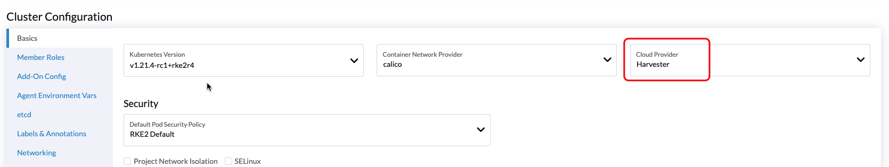

Harvester Cloud Provider
==========================
[](https://github.com/harvester/cloud-provider-harvester/releases)

Harvester Cloud Provider implements the Kubernetes Cloud Controller Manager and makes Harvester a Kubernetes cloud provider. See [Introduction](https://docs.harvesterhci.io/v1.9/rancher/cloud-provider#introduction).

## Manifests and Deployment

Before deploying the Harvester Cloud Provider, ensure your Kubernetes cluster is configured for external cloud providers. For details, see the [Harvester Deployment Guide: harvester-cloud-provider deploying](https://docs.harvesterhci.io/v1.9/rancher/cloud-provider#deploying).

The `./deploy/manifests` folder contains a limited set of raw YAML manifests intended solely for lightweight development and testing. Because these manifests are not always synchronized with the full Helm chart, it is strongly recommended to install using the official Helm chart.

### Helm Chart Repository

The official charts are hosted at the [Harvester Helm Chart Repository](https://charts.harvesterhci.io).

To find the latest version and download a release manully:

1. Check the current version in the [Chart.yaml source](https://github.com/harvester/charts/blob/1779f1746118a9c27ab3560a253d00da82ed9ca8/charts/harvester-cloud-provider/Chart.yaml#L21).

2. Download the release archive for your target version (replace both instances of `0.2.15` with your target version to construct the valid chart URL):
    * [https://github.com/harvester/charts/releases/download/harvester-cloud-provider-0.2.15/harvester-cloud-provider-0.2.15.tgz](https://github.com/harvester/charts/releases/download/harvester-cloud-provider-0.2.15/harvester-cloud-provider-0.2.15.tgz)

### Requirements

It is recommended to deploy the Harvester Cloud Provider concurrently when provisioning your Kubernetes cluster via the [Harvester Node Driver](https://docs.harvesterhci.io/v1.9/rancher/node/node-driver).

Because the cloud provider relies on the Harvester cluster to fetch VM metadata, populate guest cluster node info, and support LoadBalancer services, your guest cluster must be provisioned using the Harvester node driver. This can be accomplished via Rancher's automated guest cluster deployment or through manual cluster deployment and registration.

### Deploy in the RKE2

On Rancher Manager, when create a new guest cluster, it defaults to the `harvester` cloud provider, and the node driver will help deploy both the CSI driver and CCM automatically. See [Deploying to the RKE2 Cluster with Harvester Node Driver](https://docs.harvesterhci.io/v1.9/rancher/cloud-provider#deploying-to-the-rke2-cluster-with-harvester-node-driver)



## How to Contribute

General guide is on [Harvester Developer Guide](https://github.com/harvester/harvester/blob/master/DEVELOPER_GUIDE.md).

### Build Image

1. Run `make ci` on the source code

    ```
    /go/src/github.com/harvester/cloud-provider-harvester$ make ci
    ```

1. A successful run will generate following container images.

    ```
    REPOSITORY                                                                                           TAG                                         IMAGE ID       CREATED         SIZE
    rancher/harvester-cloud-provider                                                                     d2fb13d3-amd64                              903acc7ba945   2 hours ago     133MB

    ```

1. Push or upload the new image to the running [guest cluster](https://docs.harvesterhci.io/v1.9/rancher/node/rke2-cluster#create-rke2-kubernetes-cluster), replace it to the deployment and test your change.

### Chart Development

The chart definition is managed on a central repo `https://github.com/harvester/charts`. Changes needs to be sent to it.

https://github.com/harvester/charts/tree/master/charts/harvester-cloud-provider

For more information, see [Chart README](https://github.com/harvester/charts/blob/master/README.md).

This chart targets to integrate with Rancher Manager and RKE2, see [Harvester Cloud Provider](https://docs.harvesterhci.io/v1.9/rancher/cloud-provider).

## License

Copyright (c) 2026 [SUSE, LLC.](https://www.suse.com/)

Licensed under the Apache License, Version 2.0 (the "License");
you may not use this file except in compliance with the License.
You may obtain a copy of the License at

[http://www.apache.org/licenses/LICENSE-2.0](http://www.apache.org/licenses/LICENSE-2.0)

Unless required by applicable law or agreed to in writing, software
distributed under the License is distributed on an "AS IS" BASIS,
WITHOUT WARRANTIES OR CONDITIONS OF ANY KIND, either express or implied.
See the License for the specific language governing permissions and
limitations under the License.